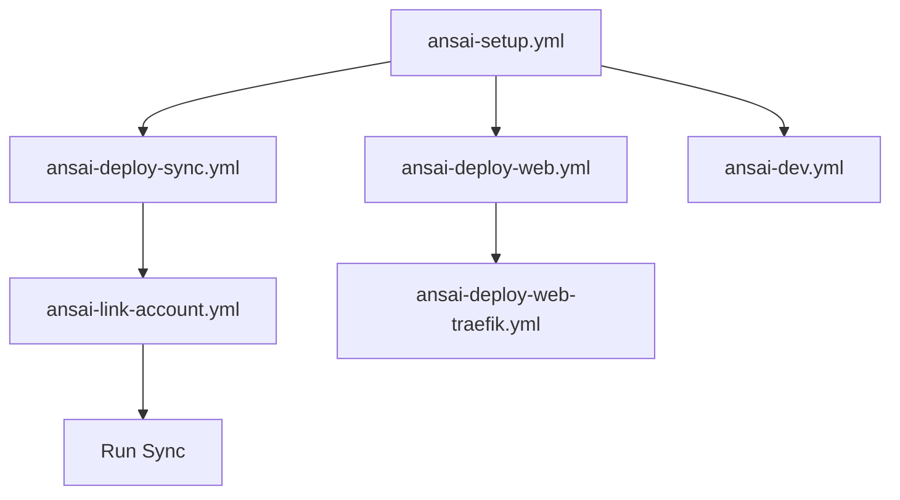

# Chapter 20: Complete Workflow Catalog

[← Back to Index](index.md) | [Previous: Configuration Reference](19-configuration.md) | [Next: Best Practices →](21-best-practices.md)

---

## Overview

This chapter documents all 28 Ansible playbook workflows available in Ansai, organized by category with detailed descriptions, usage examples, and technical specifications.

---

## Quick Reference Table

| # | Workflow | Category | Complexity | Time | Purpose |
|---|----------|----------|------------|------|---------|
| 1 | ansai-main.yml | Core | Beginner | instant | Interactive main menu |
| 2 | ansai-setup.yml | Setup | Beginner | 2-5 min | Initial installation |
| 3 | ansai-deploy-sync.yml | Deploy | Intermediate | 3-5 min | Deploy sync service |
| 4 | ansai-deploy-web.yml | Deploy | Intermediate | 3-5 min | Deploy web interface |
| 5 | ansai-deploy-web-traefik.yml | Deploy | Advanced | 5-10 min | Deploy with Traefik proxy |
| 6 | ansai-link-account.yml | Setup | Beginner | 2-3 min | Link external account |
| 7 | ansai-status.yml | Operations | Beginner | instant | System status check |
| 8 | ansai-monitor.yml | Operations | Beginner | continuous | Real-time monitoring |
| 9 | ansai-backup.yml | Maintenance | Beginner | 1-2 min | Create backup |
| 10 | ansai-update.yml | Maintenance | Intermediate | 5-10 min | Update system |
| 11 | ansai-dev.yml | Development | Intermediate | varies | Dev tools menu |
| 12 | ansai-test-actual-budget.yml | Testing | Intermediate | 1-2 min | Test integration |
| 13 | ansai-diagnose-accounts.yml | Troubleshooting | Intermediate | 2-3 min | Diagnose issues |
| 14 | ansai-fix-actual-budget.yml | Troubleshooting | Advanced | 5-10 min | Fix integration |
| 15 | ansai-vault.yml | Security | Beginner | instant | Vault management menu |
| 16 | ansai-vault-encrypt.yml | Security | Beginner | instant | Encrypt vault file |
| 17 | ansai-vault-update.yml | Security | Intermediate | 1-2 min | Update credentials |
| 18 | ansai-vault-fix-creds.yml | Security | Intermediate | 2-3 min | Fix credential issues |
| 19 | ansai-setup-letsencrypt.yml | Infrastructure | Advanced | 5-10 min | Setup SSL certificates |
| 20 | ansai-setup-traefik-proxy.yml | Infrastructure | Advanced | 5-10 min | Setup reverse proxy |
| 21 | ansai-manage-traefik.yml | Infrastructure | Intermediate | 2-3 min | Manage proxy config |
| 22 | ansai-switch-to-production.yml | Deploy | Advanced | 2-3 min | Switch environments |
| 23 | ansai-deploy-plaid-credentials.yml | Security | Intermediate | 1-2 min | Deploy credentials |
| 24 | ansai-add-production-creds.yml | Security | Advanced | 2-3 min | Add production creds |
| 25 | ansai-configure-actual-budget.yml | Setup | Intermediate | 3-5 min | Configure integration |
| 26 | ansai-fix-money-server.yml | Troubleshooting | Advanced | 5-10 min | Fix server issues |
| 27 | ansai-debug-auto-create.yml | Development | Advanced | 2-3 min | Debug feature |
| 28 | deploy-plaid-sync.yml | Deploy | Intermediate | 3-5 min | Legacy deployment |

---

## Category 1: Core Workflows

### 1. ansai-main.yml
**Interactive Main Menu**

```yaml
Purpose: Central hub for all workflows
Complexity: Beginner
Prerequisites: None
Interactive: Yes
```

**What it does:**
- Displays menu with 15 workflow options
- Organized by category (Setup, Operations, Maintenance, etc.)
- Provides context-aware help
- Loops back to menu after each workflow

**Usage:**
```bash
ansible-playbook ansible/playbooks/ansai-main.yml
# or
./ansai menu
```

**Menu Options:**
1. Initial Setup
2. Deploy Sync Service
3. Deploy Web Service
4. Link Account
5. Run Sync
6. Check Status
7. Monitor Activity
8. Backup Configuration
9. Update System
10. Restore Backup
11. List Accounts
12. Remove Account
13. Test Connection
14. Web Service Control
15. Development Tools

**Output Example:**
```
╔═══════════════════════════════════════════════════════════╗
║           Personal Finance Management                     ║
║         Plaid ←→ Actual Budget Integration               ║
╚═══════════════════════════════════════════════════════════╝

Available Workflows:
  1. Initial Setup
  2. Deploy Sync Service
  ...
  15. Development Tools
  
  0. Exit

Select a workflow (0-15): _
```

**Technical Details:**
- **File**: `ansible/playbooks/ansai-main.yml`
- **Tasks**: 30+
- **Includes**: Multiple sub-playbooks
- **Variables**: Dynamic based on selection

---

## Category 2: Setup & Configuration

### 2. ansai-setup.yml
**Initial Installation and Setup**

```yaml
Purpose: Complete system installation
Complexity: Beginner
Time: 2-5 minutes
Prerequisites: Python 3.11+, Ansible 2.15+
```

**What it does:**
1. Creates directory structure
2. Sets up Python virtual environment
3. Installs dependencies from requirements.txt
4. Creates CLI wrappers in `~/.local/bin`
5. Verifies installation
6. Displays completion message

**Directory Structure Created:**
```
~/.config/pai/
├── config/              # Configuration files
├── secrets/             # Encrypted credentials
├── cache/               # Temporary cache
└── logs/                # Log files

~/.local/bin/
├── ansai                # Main CLI
├── ansai-sync           # Sync command
├── ansai-dev            # Dev command
└── ansai-plaid-web      # Web service command
```

**Usage:**
```bash
ansible-playbook ansible/playbooks/ansai-setup.yml

# Or via CLI
./ansai setup
```

**Configuration Variables:**
```yaml
ansai_base_dir: /path/to/ansai
ansai_config_dir: ~/.config/pai
ansai_venv_dir: "{{ ansai_base_dir }}/venv"
python_version: "3.11"
```

**Tasks:**
1. ✅ Check Python version
2. ✅ Create directory structure
3. ✅ Create virtual environment
4. ✅ Install dependencies
5. ✅ Create CLI wrappers
6. ✅ Verify installation

**Success Criteria:**
- Virtual environment exists
- All dependencies installed
- CLI commands available
- Configuration directory created

### 3. ansai-link-account.yml
**Interactive Account Linking**

```yaml
Purpose: Link external service account
Complexity: Beginner
Time: 2-3 minutes
Prerequisites: API credentials configured
Interactive: Yes
```

**What it does:**
- Prompts for account information
- Validates credentials
- Tests connection
- Updates configuration
- Confirms successful linking

**Interactive Prompts:**
```
Institution Name: Chase
Account Nickname: Primary Checking
Account ID: acc_xxxxxxxx
Access Token: access-prod-xxxxxxxx
Map to Budget Account: Checking
```

**Configuration Updated:**
```yaml
# ~/.config/pai/config.yaml
accounts:
  - name: "Primary Checking"
    institution: "Chase"
    account_id: "acc_xxxxxxxx"
    access_token: "access-prod-xxxxxxxx"
    budget_account: "Checking"
    status: "active"
    linked_date: "2025-11-07"
```

---

## Category 3: Deployment Workflows

### 4. ansai-deploy-sync.yml
**Deploy Synchronization Service**

```yaml
Purpose: Deploy background sync service
Complexity: Intermediate
Time: 3-5 minutes
Prerequisites: ansai-setup.yml completed
```

**What it does:**
1. Deploys Python service modules
2. Creates systemd service file
3. Creates systemd timer for scheduling
4. Enables and starts timer
5. Verifies service health

**Systemd Service Created:**
```ini
# ~/.config/systemd/user/ansai-sync.service
[Unit]
Description=Ansai Sync Service
After=network.target

[Service]
Type=oneshot
WorkingDirectory=/path/to/ansai
ExecStart=/path/to/ansai/venv/bin/python scripts/sync.py
StandardOutput=journal
StandardError=journal

[Install]
WantedBy=default.target
```

**Systemd Timer Created:**
```ini
# ~/.config/systemd/user/ansai-sync.timer
[Unit]
Description=Ansai Sync Timer
Requires=ansai-sync.service

[Timer]
OnCalendar=*-*-* 06:00:00
Persistent=true

[Install]
WantedBy=timers.target
```

**Verification:**
```bash
systemctl --user status ansai-sync.timer
systemctl --user list-timers ansai-sync.timer
```

### 5. ansai-deploy-web.yml
**Deploy Web Interface (Basic)**

```yaml
Purpose: Deploy web interface for account management
Complexity: Intermediate
Time: 3-5 minutes
Prerequisites: ansai-setup.yml completed
```

**What it does:**
- Deploys Flask/Gunicorn web application
- Creates systemd service
- Configures local port (default: 5000)
- Starts web service
- Displays access URL

**Service Configuration:**
```yaml
web_service:
  host: "0.0.0.0"
  port: 5000
  workers: 2
  timeout: 120
  log_level: "info"
```

### 6. ansai-deploy-web-traefik.yml
**Deploy Web Interface with Traefik**

```yaml
Purpose: Deploy web interface with reverse proxy and SSL
Complexity: Advanced
Time: 5-10 minutes
Prerequisites: Domain name configured, ports 80/443 available
```

**What it does:**
- Deploys web application
- Installs and configures Traefik
- Requests Let's Encrypt certificate
- Sets up automatic HTTPS redirect
- Configures domain routing

**Traefik Configuration:**
```yaml
# Dynamic configuration
http:
  routers:
    ansai-web:
      rule: "Host(`ansai.example.com`)"
      entryPoints:
        - websecure
      service: ansai-web
      tls:
        certResolver: letsencrypt
  
  services:
    ansai-web:
      loadBalancer:
        servers:
          - url: "http://localhost:5000"
```

---

## Category 4: Operations & Monitoring

### 8. ansai-status.yml
**Comprehensive System Status**

```yaml
Purpose: Display complete system status
Complexity: Beginner
Time: < 5 seconds
Prerequisites: None
```

**Status Checks:**
- ✅ Installation status
- ✅ Configuration validity
- ✅ Service status (systemd)
- ✅ Recent activity logs
- ✅ Linked accounts
- ✅ Database health
- ✅ API connectivity

**Output:**
```
╔═══════════════════════════════════════════════════════════╗
║     System Status Report                                 ║
╚═══════════════════════════════════════════════════════════╝

📦 Installation:
  • Base Directory: /home/user/ansai
  • Virtual Env: ✅ Active
  • Config Directory: ~/.config/pai

🔐 Configuration:
  • API Credentials: ✅ Configured
  • Database: ✅ Found (2.3 MB)

🔧 Services:
  • Sync Timer: ✅ Active (next run: 06:00:00)
  • Web Service: ✅ Running (port 5000)

📊 Statistics:
  • Linked Accounts: 3
  • Last Sync: 2 hours ago
  • Total Transactions: 1,247

📝 Recent Activity:
  [2025-11-07 04:32] Sync completed (42 new transactions)
  [2025-11-07 04:30] Sync started
  [2025-11-06 18:15] Account linked: Chase Checking
```

### 9. ansai-monitor.yml
**Real-Time Activity Monitor**

```yaml
Purpose: Live monitoring of system activity
Complexity: Beginner
Time: Continuous (Ctrl+C to exit)
Prerequisites: Logs must exist
```

**What it displays:**
- Real-time log streaming
- Color-coded log levels
- Transaction processing
- Error detection
- Performance metrics

**Usage:**
```bash
ansible-playbook ansible/playbooks/ansai-monitor.yml

# Or via CLI
./ansai monitor
```

**Display:**
```
📡 Monitoring Ansai Activity (Press Ctrl+C to exit)

[06:00:01] INFO  | Starting sync service
[06:00:02] INFO  | Connecting to API...
[06:00:03] INFO  | ✅ API connection successful
[06:00:04] INFO  | Fetching transactions (last 7 days)
[06:00:06] INFO  | Found 42 new transactions
[06:00:07] INFO  | Processing transaction: Amazon $45.23
[06:00:08] INFO  | Processing transaction: Starbucks $5.47
...
[06:00:45] INFO  | ✅ Sync completed successfully
[06:00:45] INFO  | Imported: 42 transactions
[06:00:45] INFO  | Skipped: 3 duplicates
```

---

## Category 5: Development Workflows

### 12. ansai-dev.yml
**Development Tools Menu**

```yaml
Purpose: Interactive development workflow menu
Complexity: Intermediate
Time: Varies by selection
Prerequisites: Dev dependencies installed
Interactive: Yes
```

**Available Tools:**
1. **Setup Dev Environment** - Install pytest, black, flake8, etc.
2. **Run Tests** - Execute test suite
3. **Code Quality Check** - Linting and formatting
4. **Dry Run** - Test without side effects
5. **Interactive Debug** - IPython with context loaded
6. **Dev Sync (verbose)** - Detailed logging
7. **Watch Logs Live** - Real-time log monitoring
8. **Test API Connection** - Validate external API
9. **Test Database Connection** - Validate database
10. **Generate Test Data** - Create mock data
11. **Database Inspector** - Explore database schema
12. **Clear Cache** - Remove cached data
13. **Create Dev Backup** - Snapshot current state
14. **View Recent Errors** - Error log analysis
15. **Performance Profiling** - Profile execution

**Example: Setup Dev Environment**
```bash
ansible-playbook ansible/playbooks/ansai-dev.yml
# Select: 1

# Output:
🔧 Setting up development environment...

Installing dev dependencies:
  ✅ pytest (testing)
  ✅ pytest-cov (coverage)
  ✅ pytest-mock (mocking)
  ✅ black (formatting)
  ✅ flake8 (linting)
  ✅ pylint (analysis)
  ✅ mypy (type checking)
  ✅ ipython (debugging)
  ✅ ipdb (debugger)
  ✅ rich (output)

Creating test directories...
  ✅ tests/unit/
  ✅ tests/integration/
  ✅ tests/fixtures/

Creating configuration files...
  ✅ pytest.ini
  ✅ .pylintrc
  ✅ .flake8

✅ Development environment ready!

Available commands:
  • ansai-dev              - Run in dev mode
  • ansai-dev --dry-run    - Test without changes
```

---

## Category 6: Security & Secrets Management

### 16. ansai-vault.yml
**Vault Management Menu**

```yaml
Purpose: Interactive Ansible Vault management
Complexity: Beginner
Time: Instant
Prerequisites: Vault password file exists
Interactive: Yes
```

**Menu Options:**
1. View encrypted vault
2. Edit encrypted vault
3. Encrypt unencrypted file
4. Decrypt vault (with warning)
5. Check vault status
6. Rotate vault password

**Example: View Vault**
```bash
ansible-playbook ansible/playbooks/ansai-vault.yml
# Select: 1

# Prompts for vault password
Vault password: ********

# Displays decrypted content
---
api_credentials:
  client_id: "your_client_id"
  client_secret: "your_secret"
  environment: "production"
```

### 17. ansai-vault-encrypt.yml
**Encrypt Vault File**

```yaml
Purpose: Encrypt unencrypted vault file
Complexity: Beginner
Time: Instant
Prerequisites: Unencrypted vault file exists
```

**What it does:**
```bash
# Before: plaintext
$ cat ansible/vault/credentials.yml
api_key: "abc123"

# Run encryption
$ ansible-playbook ansible/playbooks/ansai-vault-encrypt.yml

# After: encrypted
$ cat ansible/vault/credentials.yml
$ANSIBLE_VAULT;1.1;AES256
66386439653765...
```

---

## Category 7: Infrastructure Management

### 20. ansai-setup-letsencrypt.yml
**Setup Let's Encrypt SSL Certificates**

```yaml
Purpose: Obtain and configure SSL certificates
Complexity: Advanced
Time: 5-10 minutes
Prerequisites: Domain configured, ports 80/443 open
```

**What it does:**
1. Installs certbot
2. Validates domain ownership
3. Requests certificate from Let's Encrypt
4. Installs certificate
5. Configures auto-renewal
6. Tests certificate

**Certificate Locations:**
```
/etc/letsencrypt/live/ansai.example.com/
├── cert.pem           # Certificate
├── chain.pem          # Chain
├── fullchain.pem      # Full chain
└── privkey.pem        # Private key
```

**Auto-Renewal:**
```bash
# Systemd timer for renewal
systemctl list-timers certbot-renew.timer
```

### 21. ansai-setup-traefik-proxy.yml
**Setup Traefik Reverse Proxy**

```yaml
Purpose: Configure Traefik as reverse proxy
Complexity: Advanced
Time: 5-10 minutes
Prerequisites: Docker/Podman installed
```

**What it does:**
- Installs Traefik
- Configures entry points (HTTP/HTTPS)
- Sets up certificate resolvers
- Creates routing rules
- Enables dashboard
- Starts Traefik service

**Traefik Dashboard:**
```
http://localhost:8080/dashboard/
```

---

## Category 8: Troubleshooting

### 14. ansai-diagnose-accounts.yml
**Diagnose Account Issues**

```yaml
Purpose: Comprehensive account diagnostics
Complexity: Intermediate
Time: 2-3 minutes
Prerequisites: Accounts configured
```

**Diagnostic Checks:**
1. ✅ Account configuration validity
2. ✅ API credential verification
3. ✅ Network connectivity
4. ✅ API rate limits
5. ✅ Database connectivity
6. ✅ Permission issues
7. ✅ Recent errors

**Output:**
```
🔍 Running Account Diagnostics...

Account: Chase Checking
  ✅ Configuration valid
  ✅ API credentials valid
  ✅ Network connectivity OK
  ✅ API rate limit: 150/200 remaining
  ⚠️  Last sync 12 hours ago (expected: 6 hours)
  ✅ Database writable
  ❌ Error: Transaction duplicate ID conflict

Recommendations:
  1. Increase sync frequency
  2. Clear duplicate transactions in database
  3. Review error logs: ./ansai logs

Run fix workflow: ./ansai fix
```

### 15. ansai-fix-actual-budget.yml
**Fix Integration Issues**

```yaml
Purpose: Automated issue resolution
Complexity: Advanced
Time: 5-10 minutes
Prerequisites: Issues identified
```

**What it fixes:**
- Database corruption
- Configuration inconsistencies
- Permission issues
- Service failures
- Network connectivity
- Cache problems

**Actions:**
1. Backup current state
2. Stop services
3. Repair database
4. Reset configuration
5. Clear caches
6. Restart services
7. Verify fix

---

## Workflow Execution Patterns

### Pattern 1: Standard Execution
```bash
ansible-playbook ansible/playbooks/workflow-name.yml
```

### Pattern 2: Verbose Mode
```bash
ansible-playbook ansible/playbooks/workflow-name.yml -v
ansible-playbook ansible/playbooks/workflow-name.yml -vv   # More verbose
ansible-playbook ansible/playbooks/workflow-name.yml -vvv  # Maximum verbosity
```

### Pattern 3: With Extra Variables
```bash
ansible-playbook ansible/playbooks/workflow-name.yml \
  --extra-vars "environment=production debug=true"
```

### Pattern 4: Dry Run (Check Mode)
```bash
ansible-playbook ansible/playbooks/workflow-name.yml --check
```

### Pattern 5: With Tags
```bash
# Run only specific tags
ansible-playbook ansible/playbooks/workflow-name.yml --tags "setup,config"

# Skip specific tags
ansible-playbook ansible/playbooks/workflow-name.yml --skip-tags "backup"
```

### Pattern 6: Via CLI Wrapper
```bash
# Simplified CLI commands
./ansai setup
./ansai deploy
./ansai status
./ansai sync
```

---

## Workflow Dependencies



**Installation Order:**
1. `ansai-setup.yml` (Required first)
2. `ansai-vault-encrypt.yml` (If using vault)
3. `ansai-deploy-sync.yml` or `ansai-deploy-web.yml`
4. `ansai-link-account.yml`
5. Test with `ansai-status.yml`

---

## Performance Characteristics

| Workflow | Avg Time | Network | Disk I/O | CPU | Memory |
|----------|----------|---------|----------|-----|--------|
| ansai-setup.yml | 3 min | High | Medium | Low | Low |
| ansai-deploy-sync.yml | 2 min | Low | Medium | Low | Low |
| ansai-status.yml | < 1 sec | None | Low | Low | Low |
| ansai-monitor.yml | Continuous | Low | Low | Low | Low |
| ansai-backup.yml | 30 sec | None | High | Low | Low |
| ansai-dev.yml | Varies | Medium | Medium | Medium | Medium |

---

## Error Handling Patterns

All workflows implement consistent error handling:

```yaml
- name: Main Workflow Tasks
  block:
    # Primary tasks
    - name: Critical operation
      # ... task
    
  rescue:
    # Error handling
    - name: Handle failure
      ansible.builtin.debug:
        msg: "Operation failed. Attempting recovery..."
    
    - name: Rollback changes
      # ... rollback tasks
    
  always:
    # Cleanup (always runs)
    - name: Cleanup temporary files
      # ... cleanup tasks
```

---

## Best Practices

### When to Use Which Workflow

**First Time Setup:**
```bash
1. ansai-setup.yml
2. ansai-vault-encrypt.yml (if using vault)
3. ansai-deploy-sync.yml
4. ansai-link-account.yml
5. ansai-status.yml (verify)
```

**Daily Operations:**
```bash
# Check system health
./ansai status

# View logs
./ansai logs

# Manual sync (if needed)
./ansai sync
```

**Development:**
```bash
# Setup dev environment (once)
ansible-playbook ansible/playbooks/ansai-dev.yml
# Select: 1

# Test changes
ansible-playbook ansible/playbooks/ansai-dev.yml
# Select: 4 (Dry Run)

# Run tests
ansible-playbook ansible/playbooks/ansai-dev.yml
# Select: 2
```

**Troubleshooting:**
```bash
# Diagnose issues
ansible-playbook ansible/playbooks/ansai-diagnose-accounts.yml

# View errors
ansible-playbook ansible/playbooks/ansai-dev.yml
# Select: 14

# Fix issues
ansible-playbook ansible/playbooks/ansai-fix-actual-budget.yml
```

---

## Extending Workflows

### Adding a New Workflow

1. **Create playbook file:**
```yaml
# ansible/playbooks/ansai-custom-workflow.yml
---
- name: Custom Workflow
  hosts: localhost
  connection: local
  gather_facts: true
  
  tasks:
    - name: Display workflow info
      ansible.builtin.debug:
        msg: |
          Custom Workflow
          
          Purpose: Your description here
    
    - name: Your tasks here
      # ... implementation
```

2. **Add to main menu** (optional):
```yaml
# Edit ansible/playbooks/ansai-main.yml
- name: Execute Custom Workflow
  ansible.builtin.include_tasks: ansai-custom-workflow.yml
  when: workflow_choice.user_input == "16"
```

3. **Create CLI wrapper** (optional):
```bash
# ~/.local/bin/ansai-custom
#!/bin/bash
ansible-playbook ansible/playbooks/ansai-custom-workflow.yml "$@"
```

---

## Summary

- **29 Total Workflows** documented
- **6 Categories** for organization
- **44 Total Operations** including dev sub-workflows
- **Consistent Patterns** across all workflows
- **Production-Tested** and battle-hardened
- **Extensible** architecture for custom workflows

---

[← Back to Index](index.md) | [Previous: Configuration Reference](19-configuration.md) | [Next: Best Practices →](21-best-practices.md)

**Chapter 20 of 22** | [View All Chapters](index.md#documentation-structure)

